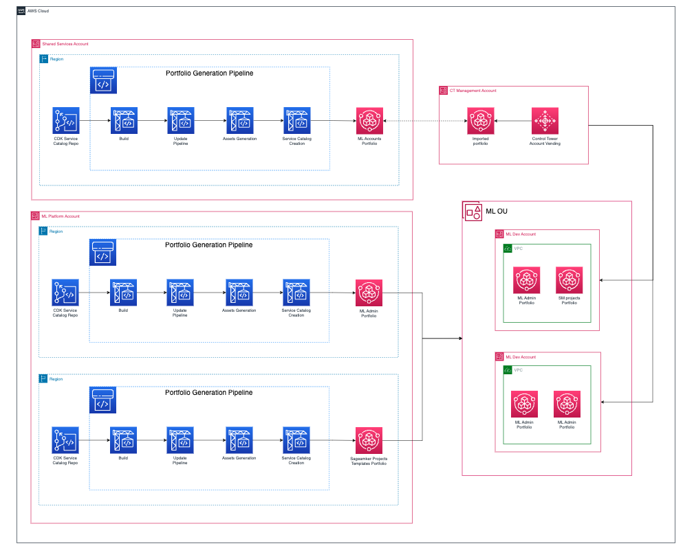

# ML Governance Workshop

This repository contains the resources that are required to follow modules 1 and 3 from the [Multi-Account Data & ML Governance Workshop](https://studio.us-east-1.prod.workshops.aws/workshops/367f5c92-0764-4959-9279-e6f105f0c670#builds)

The infrastucture mentioned in this repository should be deployed in the Landing Zone Shared Services Infrastructure Account and ML Plarform Shared Services Account. The resulting Service Catalog portfolios from this repository will be used by the account vending feature of Control Tower to bootstrap new ML Accounts and by the ML Admins and Data Scientists in the Sagemaker Studio Accounts.

**NOTE:**

To effectively use this repository you would need to have a good understanding around AWS networking services, AWS CloudFormation and AWS CDK.

## Index

- [Architecture](#architecture)

# Architecture

## Solution Architecture

## Security

See [CONTRIBUTING](CONTRIBUTING.md#security-issue-notifications) for more information.

## License

This library is licensed under the MIT-0 License. See the LICENSE file.

