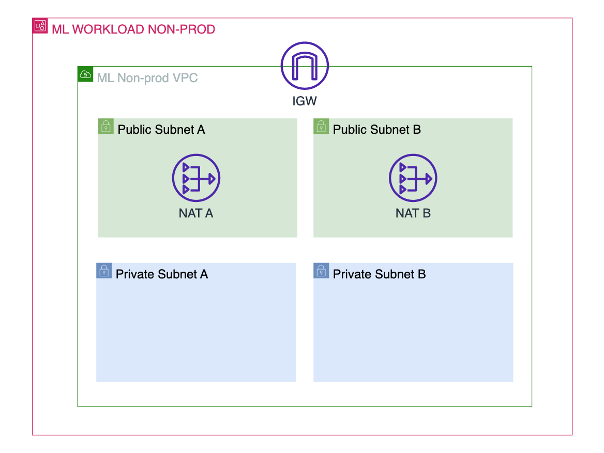
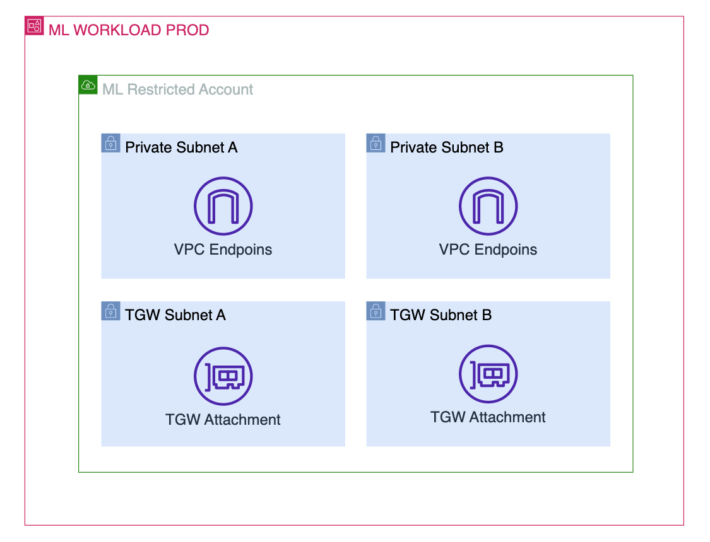
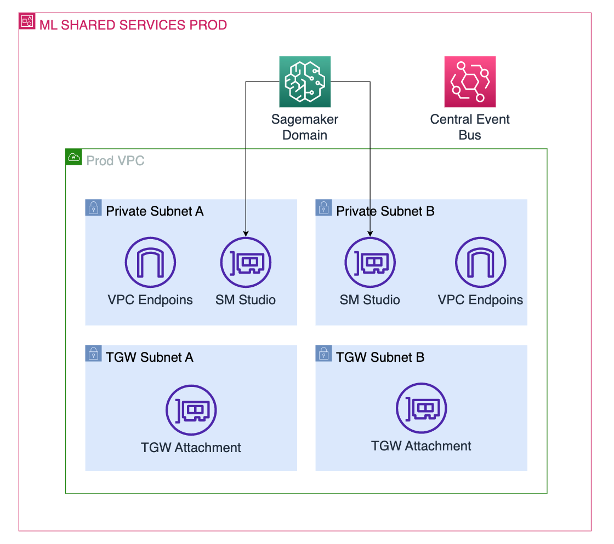

# Account Bootstrapping Portfolio

This repository contains the resources that are required to create the account bootstrapping solution for the ML Platform best practices workshop.

The infrastructure mentioned in this repository should be deployed in the Landing Zone Shared Services Infrastructure Account. The resulting Service Catalog portfolio from this repository will be used by the account vending feature of Control Tower to bootstrap new ML Accounts.

**NOTE** To effectively use this repository you would need to have a good understanding around AWS networking services, AWS CloudFormation and AWS CDK.

## Index

- [Account Bootstrapping Portfolio](#account-bootstrapping-portfolio)
  - [Index](#index)
  - [Architecture](#architecture)
    - [Solution Architecture](#solution-architecture)
    - [Pipeline Stack](#pipeline-stack)
    - [Service Catalog Stacks](#service-catalog-stacks)
      - [ML Workload Non Prod](#ml-workload-non-prod)
      - [ML Workload Prod](#ml-workload-prod)
      - [ML Shared Services Non Prod](#ml-shared-services-non-prod)
      - [ML Shared Services Prod](#ml-shared-services-prod)
  - [Getting Started](#getting-started)
    - [Prerequisites](#prerequisites)
    - [Bootstrap the Infrastructure Shared Services Account](#bootstrap-the-infrastructure-shared-services-account)
    - [Deployment](#deployment)
    - [Clean-up](#clean-up)
  - [Troubleshooting](#troubleshooting)

## Architecture

### Solution Architecture


The architecture performs the following steps:

1. The repository hosts the CDK template for the pipeline and the different templates that will be converted into Service Catalog products for account bootstrapping. This is connected to AWS services via CodeConnection
2. Whenever a change happens in the repository the pipeline is triggered and it performs the following steps:

     - Checks if any changes have been made to the pipeline itself.
     - Converts the CDK templates into CloudFormation assets.
     - Imports them into the Blueprints Portfolio for account vending.

3. The blueprints portfolio is maintained by the CCOE or a global infrastructure team, however is responsible of the Shared Services Hub Account.
4. The Control Management account has access to this portfolio thanks to the "AWSControlTowerBlueprintAccess" role created in the previous section.
5. New accounts can be easily created including blueprints that include all the necessary resources to get ML Projects started right away.

### Pipeline Stack

The pipeline stack deploys all the resources shown in the Account Hub in the above diagram:

1. CodeConnection with repository. This repository will host this same code and code updates in it will trigger the pipeline.
2. CodePipeline pipeline with the steps to convert the CDK resources in this repository into Service Catalog Products.

### Service Catalog Stacks

In this section the different stacks that will be converted to Service Catalog Products are explained

#### ML Workload Non Prod



This stack deploys a VPC with 2 private subnets and 2 public subnets with NAT Gateway egress to internet.

This stack is intended to be use for development accounts that are outside the company´s network and for testing new products or ideas.

#### ML Workload Prod



This stack deploys a VPC with 2 private subnets and 2 transit subnets with Transit Gateway attachments for connectivity with the corporate network.

This stack is intended to bootstrap production accounts that require connectivity to the corporate network. It will need as a requirement that a TGW exists in the AWS Landing Zone.

#### ML Shared Services Non Prod


Regarding connectivity this stack is identical to the ML Workload Non-prod, but it comes with a Amazon SageMaker Domain and an Amazon Eventbridge Bus so that the account can be used by ML Engineering teams to get up to speed and creating new services faster.

#### ML Shared Services Prod



Regarding connectivity this stack is identical to the ML Workload Prod, but it comes with a Amazon SageMaker Domain and an Amazon Eventbridge Bus so that the account can be used by ML Engineering teams to get up to speed and creating new services faster.

## Getting Started

### Prerequisites

This is an AWS CDK project written in Python 3.10. Here's what you need to have on your workstation before you can deploy this project. It is preferred to use a linux OS to be able to run all cli commands and avoid path issues.

- [Node.js](https://nodejs.org/)
- [Python3.10](https://www.python.org/downloads/release) or [Miniconda](https://docs.conda.io/en/latest/miniconda.html)
- [AWS CDK v2](https://aws.amazon.com/cdk/)
- [AWS CLI](https://aws.amazon.com/cli/)
- [Docker](https://docs.docker.com/desktop/)

### Bootstrap the Infrastructure Shared Services Account

follow the steps below to achieve that:

1. Clone this repository in your work environment (e.g. your laptop)

    ```bash
    git clone https://github.com/aws-samples/data-and-ml-governance-workshop.git
    ```

2. Change directory to `module-1/account-bootstrap-service-catalog-repo` root

    ```bash
    cd module-1/account-bootstrap-service-catalog-repo
    ```

3. Install dependencies in a separate python environment using your favorite python packages manager. You can refer to `scripts/install-prerequisites-brew.sh` for commands to setup a python environment.

    ```bash
    python3 -m venv env
    source env/bin/activate
    pip install -r requirements.txt
    ```

4. Bootstrap your deployment target account using the following command:

    ```bash
    cdk bootstrap aws://<target account id>/<target region> --profile <target account profile>
    ```

    or, assuming you are already the profile of the account where you want to deploy:

    ```bash
    cdk bootstrap
    ```

**Note:** to check if you are the correct role run:

```bash
aws sts get-caller-identity
```

For more information read the [AWS CDK documentation on Bootstrapping](https://docs.aws.amazon.com/cdk/v2/guide/bootstrapping.html#bootstrapping-howto)

### Deployment

Now we are going to set up the required resources in our Infrastructure Shared Services Account. For that follow this steps:

1. Deploy the stack with the CodeConnection and the corresponding pipeline

    ```bash
    cdk deploy --all --require-approval never
    ```

2. We create an empty GitHub repository to host our code

3. Lets create the initial commit for our repository

    ```console
    git clone https://github.com/example-org/ml-infra-service-catalog-repo.git
    git add .
    git commit -m "Initial commit"
    git push -u origin main
    ```

### Clean-up

Destroy the deployed stack in the Shared Services Infrastructure Account

```console
cdk destroy --all --profile <YOUR_PROFILE>
```

This command could fail in the following cases:

- **S3 bucket not empty**

If you get this error just simply go to the console and empty the S3 bucket that caused the error and run the destroy command again.

- **Resource being used by another resource**

This error is harder to track and would require some effort to trace where is the resource that we want to delete is being used and severe that dependency before running the destroy command again.

**NOTE** You should just really follow CloudFormation error messages and debug from there as they would include details about which resource is causing the error and in some occasion information into what needs to happen in order to resolve it.

## Troubleshooting

- **CDK version X instead of Y**

This error relates to a new update to cdk so run `npm install -g aws-cdk` again to update your cdk to the latest version and then run the deployment step again for each account that your stacks are deployed.

- **`cdk synth`** **not running**  
One of the following would solve the problem:

  - Docker is having an issue so restart your docker daemon
  - Refresh your awscli credentials
  - Clear all cached cdk outputs by running `make clean`
- **[Error at /ml-deploy-pipeline/****<****env****>****/networking] Need to perform AWS calls for account X, but no credentials have been configured**  
You can resolve this error by adding availability zone information to `cdk.context.json`. This error happens as CDK tries to do a lookup on the account to check which Availability Zones does the region of the target account have available and if it can be deployed across the targeted 3 AZs.

```json
"availability-zones:account=<account_id>:region=eu-west-1": [
    "eu-west-1a",
    "eu-west-1b",
    "eu-west-1c"
]
```
