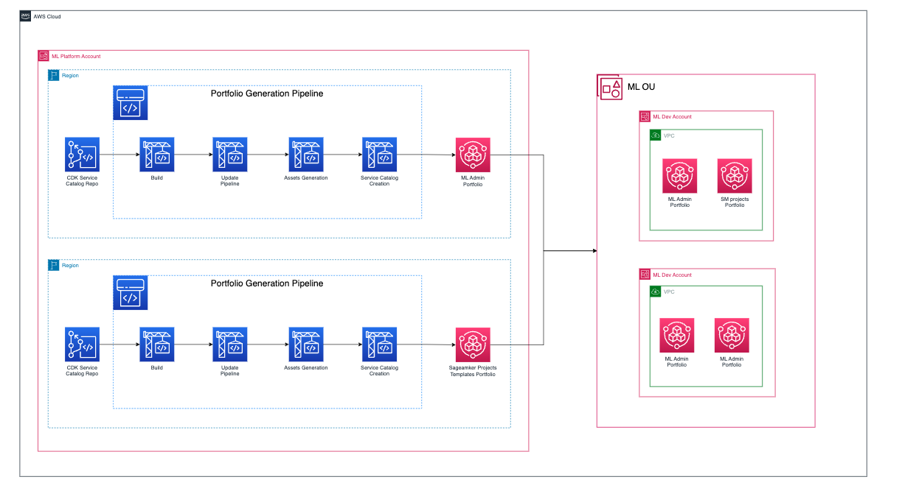
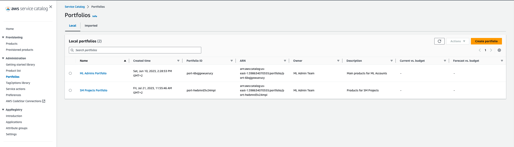
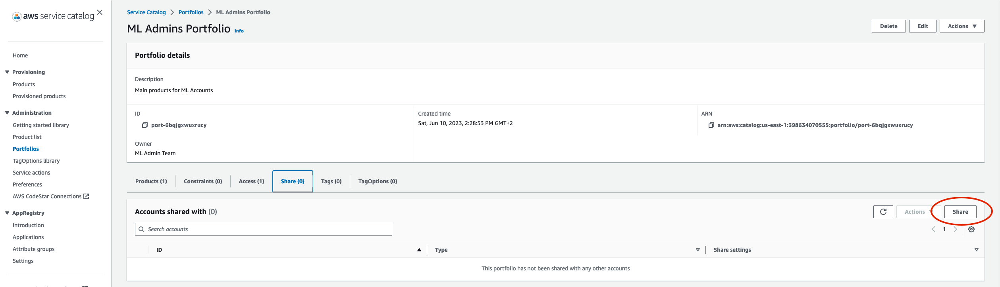
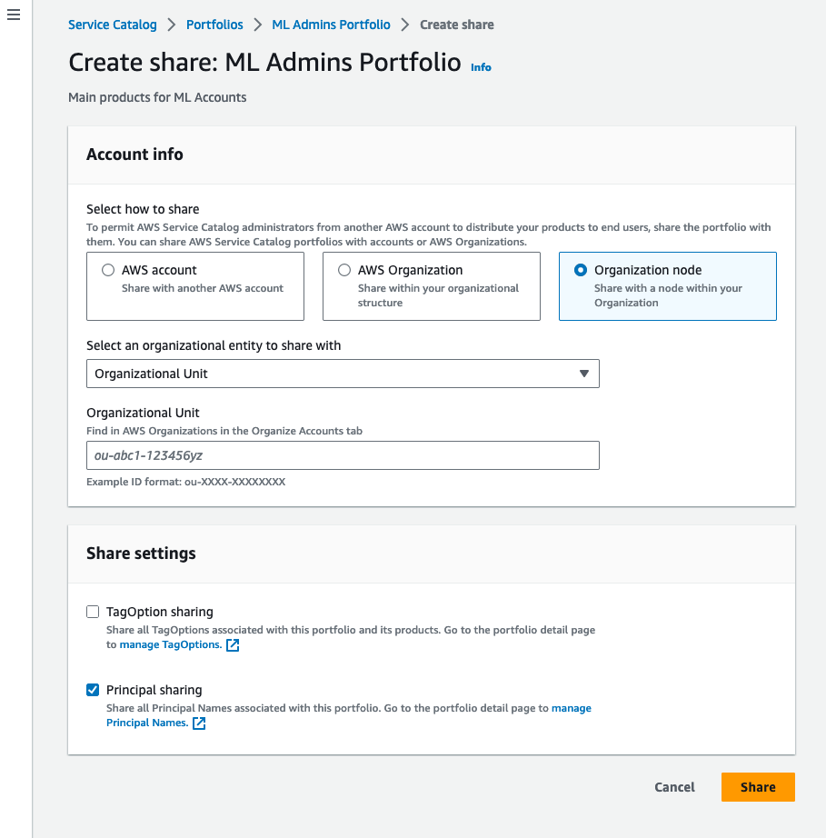
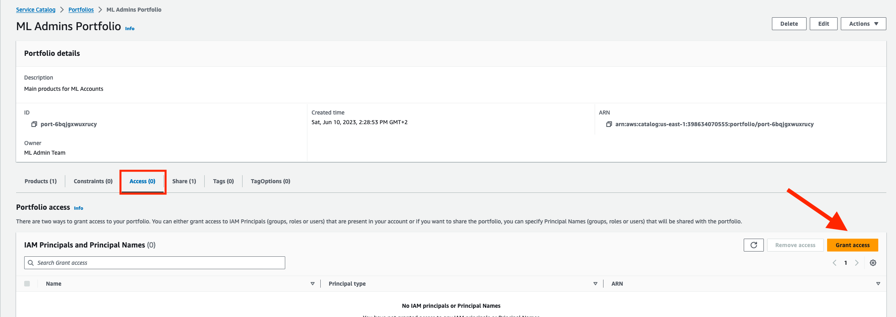
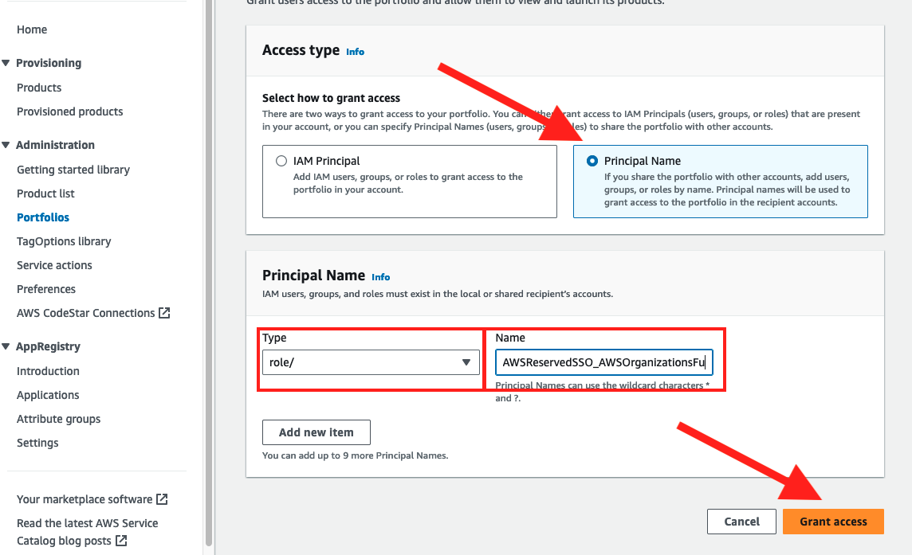
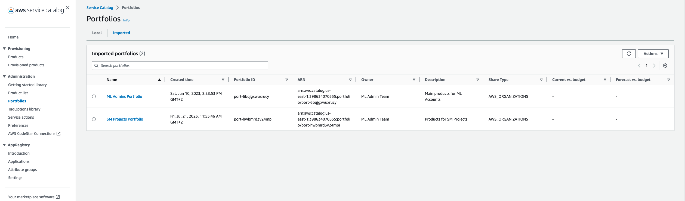

# Module 3: Set Up ML Platform Shared Services

This module helps the ML Platform Engineering Team setup shared services that are used by the Data Science teams on their team accounts. IN this model we will deploy and share two different Service Catalog Portfolios from the ML Platform Shared Services Account:

- **ML Admin Portfolio**: includes the products that the admins of the ML development accounts will have to deploy infrastructure for their teams. This products include Sagemaker Domains, Databases...
- **SageMaker Projects portfolio**: includes the products that will be used via SageMaker Projects by the data scientists to provision their ML Projects according to the corporate best practices.

## Architecture



## Deployment

### Service Catalog Deployments

To deploy the repositories and the pipelines associated with them follow the instructions in 

- [ML Admin Portfolio Deployment](ml-admin-portfolio/README.md)
- [Sagemaker Projects Portfolio Deployment](sagemaker-projects-portfolio/README.md)

## Share ML Admin and SM Project portfolios

In this section we will see how we can make the priviously created portfolios available with all the acccounts in the ML Dev Organizational Unit

### Prerriquisites

- For this section your will need the Organizational Unit id of the Workloads OU, it has the following the format ou-XXXX-XXXXXXXX. You can find these parameter in the AWS Organizations service from the Management Account.
- Set up the ML Shared Services Account as a delegated administrator account for sharing portfolios. Follow the steps in [Sharing a portfolio: Sharing from a delegated admin account](https://docs.aws.amazon.com/servicecatalog/latest/adminguide/catalogs_portfolios_sharing_how-to-share.html) or [Simplify sharing your AWS Service Catalog Portfolios in an AWS Organization setup](https://aws.amazon.com/blogs/mt/simplify-sharing-your-aws-service-catalog-portfolios-in-an-aws-organizations-setup/)

After you have enabled organizations access we will grant our ML Shared Services account Administrator permissions on Service Catalog. The command to run from the management account will be:

```bash
aws organizations register-delegated-administrator \
    --account-id <YOUR_AWS_ACCOUNT_ID> \
    --service-principal servicecatalog.amazonaws.com
```
### Sharing Steps

1. Go to [AWS Service Catalog console](https://us-east-1.console.aws.amazon.com/servicecatalog/home) and select the portfolios section




2. Click on the **ML Admins Portfolio**, go to the `Share` tab and click on Share




3. In the sharing page select the following values:

- In account Info:
    - Select Organization node
    - Choose Organizational Unit
    - Enter the Organizational Unit id of the Workloads OU
- In share settings:
    - Leave TagOption sharing blank
    - Select Principal Sharing




4. Repeat steps 2 and 3 with the SageMaker Projects Portfolio

### Granting access to portfolios

Permissions for the Portfolios will be granted automatically to the Sandbox account´s Project Administrator by using AWS Service Catalog Principal Name Sharing.

Service Catalog Principal Name allows us to specify the IAM Roles, Users or Groups by name for which we want to grant permissions in the Shared Accounts. Therefore our users assuming roles with those names in the Sandbox Accounts will be able to manage the portfolios.

To configure this follow this steps:

1. Log into the ML Shared Services account and go to the [AWS Service Catalog console](https://us-east-1.console.aws.amazon.com/servicecatalog/home)

2. Go to the **Portfolios** section and click on the **ML Admins Portfolio**. 

3. In the ML Admin Portfolio page go to the *Access* tab and click on Grant Access



4. In the Grant Access view:
    - In the Access Type section select Principal Name
    - In the Principal Name section select */role* for type and write the Name of the role that your Project Administrators will be assuming in the Sandbox Accounts. Since we are using AWS Identity Center this role will use wildcards and be somethig like: `aws-reserved/sso.amazonaws.com/*/AWSReservedSSO_AWSAdministratorAccess*`. For more information about this feature check: [AWS Service Catalog noew supports wildcards in IAM principal name associations](https://aws.amazon.com/about-aws/whats-new/2023/05/aws-service-catalog-wildcards-iam-principal-name-associations/)
    - Click on Grant Access



:::alert{header="Note" type="info"}
Repeat these steps for the SageMaker Projects for model build Portfolio
:::

#### Sagemaker Access

Access to the portfolios from the Sagemaker Roles in the Sagemaker Studio Domain will be provided at Domain creation time.

This is because the execution role of Sagemaker Studio must be provided to create the access and these roles are created together with the Domains in our ML Platform.

### Check child accounts

1. Log into any of the accounts in the Workloads OU  and go to the [AWS Service Catalog console](https://us-east-1.console.aws.amazon.com/servicecatalog/home)

2. Go to the **Portfolios** section and check the *Imported* tab. You should see the ML Admin Portfolio and the SM Projects Portfolio



3. Click on the the ML Admins Portfolio and go to the *Access* tab. You should see that the Principal Name permission has been propagated to the portfolio in this account.

4. If you go to the **Products** tab you should see all the availble products that belong to the imported portfolios and ready to be deployed.