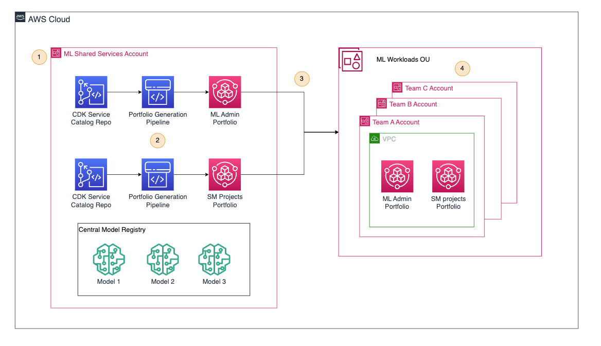

# Module 3: Set Up ML Platform Shared Services

This module helps the ML Platform Engineering Team setup shared services that are used by the Data Science teams on their team accounts. IN this model we will deploy and share two different Service Catalog Portfolios from the ML Platform Shared Services Account:

- ML Admin Portfolio: includes the products that the admins of the ML development accounts will have to deploy infrastructure for their teams. This products include Sagemaker Domains, Databases...
- SageMaker Projects portfolio: includes the products that will be used via SageMaker Projects by the data scientists to provision their ML Projects according to the corporate best practices.

## Architecture



## Deployment

### Service Catalog Deployments

To deploy the CodeCommit repositories and the pipelines associated with them follow the instructions in 

- [ML Admin Portfolio Deployment](ml-admin-portfolio/README.md)
- [Sagemaker Projects Portfolio Deployment](sagemaker-projects-portfolio/README.md)

### Cross-Account Sharing

Once both catalogs have been deployed we need to share them with the ML Dev Organizational Unit (OU), so that every new account created in this OU gets both portfolios ready to be used. You will need this OU id for the upcoming steps (ex. ou-0000-aaaabbbb)

We use organizational sharing, that shares a reference of the central portfolio, so that all ML Dev accounts are in sync with it and in case the central team makes some changes to it they get reflected in the child accounts.

To do so, follow this steps:

1. Login into your ML Platform Shared Service Account where both portfolios have been deployed.
2. Navigate to the [Service Catalog console](https://console.aws.amazon.com/servicecatalog/home)
3. In the Service Catalog console go to the Portfolios section
4. Make sure that both your ML Admin Portfolio and your SM Projects Portfolio are there
5. Select the ML Admin portfolio and in the actions button select share.
6. 


In origin accounts (ML Admins)

**Note** 
In case you find issues such as: Organizational sharing is not available. Please check this to links to enable it:
- [Sharing a Portfolio](https://docs.aws.amazon.com/servicecatalog/latest/adminguide/catalogs_portfolios_sharing_how-to-share.html)
- [Register a delegated administrator](https://docs.aws.amazon.com/AWSCloudFormation/latest/UserGuide/stacksets-orgs-delegated-admin.html)

Enable service access:

```bash
aws organizations enable-aws-service-access \
    --service-principal servicecatalog.amazonaws.com
```
```bash
aws organizations register-delegated-administrator \
  --service-principal=servicecatalog.amazonaws.com \
  --account-id="398634070555"
```

TODO: 
- Explain how to do and activate service catalog organization sharing, should probably be covered in module 1