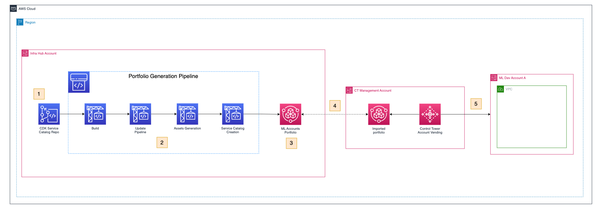
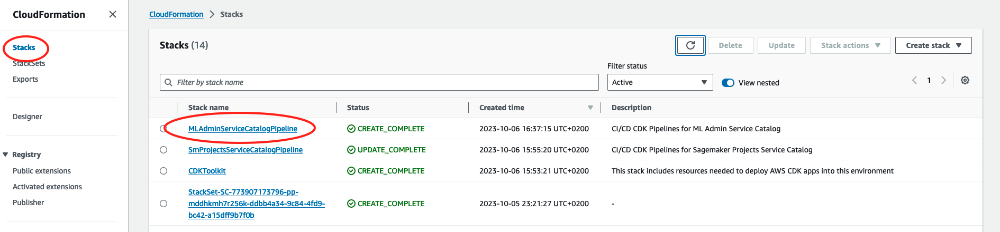
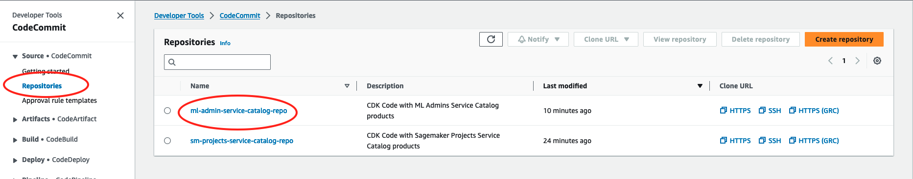
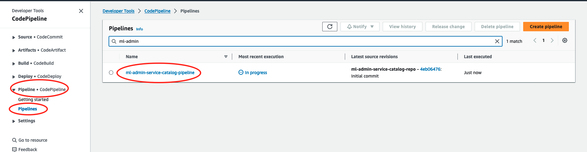
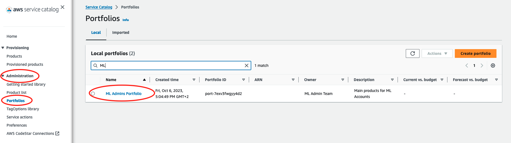

# MLOps Foundation Infrastructure

This repository contains the resources that are required to create the account bootstrapping solution for the ML Platform best practices workshop.

The infrastructure mentioned in this repository should be deployed in the Landing Zone Shared Services Infrastructure Account. The resulting Service Catalog portfolio from this repository will be used by the account vending feature of Control Tower to bootstrap new ML Accounts.

**NOTE** To effectively use this repository you would need to have a good understanding around AWS networking services, AWS CloudFormation and AWS CDK.

## Index

- [MLOps Foundation Infrastructure](#mlops-foundation-infrastructure)
  - [Index](#index)
  - [Architecture](#architecture)
    - [Solution Architecture](#solution-architecture)
    - [Pipeline Stack](#pipeline-stack)
    - [Service Catalog Stacks](#service-catalog-stacks)
      - [Amazon SageMaker Domain](#sagemaker-domain)
  - [Getting Started](#getting-started)
    - [Prerequisites](#prerequisites)
    - [Bootstrap the ML Shared Services Account](#bootstrap-the-infrastructure-shared-services-account)
    - [Deployment](#deployment)
    - [Clean-up](#clean-up)
  - [Troubleshooting](#troubleshooting)

## Architecture

### Solution Architecture



The architecture performs the following steps:

1. The CodeCommit repository hosts the CDK template for the pipeline and the different templates that will be converted into Service Catalog products for account bootstrapping.
2. Whenever a change happens in the repository the pipeline is triggered and it performs the following steps:

   - Checks if any changes have been made to the pipeline itself.
   - Converts the CDK templates into CloudFormation assets.
   - Imports them into the Blueprints Portfolio for account vending.

3. The blueprints portfolio is maintained by the CCOE or a global infrastructure team, however is responsible of the Shared Services Hub Account.
4. The Control Management account has access to this portfolio thanks to the "AWSControlTowerBlueprintAccess" role created in the previous section.
5. New accounts can be easily created including blueprints that include all the necessary resources to get ML Projects started right away.

### Pipeline Stack

The pipeline stack deploys all the resources shown in the Account Hub in the above diagram:

1. Code Commit repository. This repository will host this same code and code updates in it will trigger the pipeline.
2. CodePipeline pipeline with the steps to convert the CDK resources in this repository into Service Catalog Products.

### Service Catalog Stacks

In this section the different stacks that will be converted to Service Catalog Products are explained

#### Sagemaker Domain

This stack deploys a SageMaker Domain with connectivity to the private subnets of the ML Workload Account.

The SageMaker Domain is integrated with IAM Identity Center and everything required to get ML Teams up to speed in no time.

## Getting Started

### Prerequisites

This is an AWS CDK project written in Python 3.10. Here's what you need to have on your workstation before you can deploy this project. It is preferred to use a linux OS to be able to run all cli commands and avoid path issues.

- [Node.js](https://nodejs.org/)
- [Python3.10](https://www.python.org/downloads) or [Miniconda](https://docs.conda.io/en/latest/miniconda.html)
- [AWS CDK v2](https://aws.amazon.com/cdk/)
- [AWS CLI](https://aws.amazon.com/cli/)
- [Docker](https://docs.docker.com/desktop/)

### Bootstrap the ML Shared Services Account

Follow the steps below to achieve that:

1. Clone this repository in your work environment (e.g. your laptop)

    ```bash
    git clone https://github.com/aws-samples/data-and-ml-governance-workshop.git
    ```

2. Change directory to `module-3/ml-admin-portfolio` root

    ```bash
    cd module-3/ml-admin-portfolio
    ```

3. Install dependencies in a separate python environment using your favorite python packages manager. You can refer to `scripts/install-prerequisites-brew.sh` for commands to setup a python environment.

    ```bash
    python3 -m venv env
    source env/bin/activate
    pip install -r requirements.txt
    ```

4. Bootstrap your deployment target account using the following command:

    ```bash
    cdk bootstrap aws://<target account id>/<target region> --profile <target account profile>
    ```

    or, assuming you are already the profile of the account where you want to deploy:

    ```bash
    cdk bootstrap
    ```
**Note:** to check if you are the correct role run:

```bash
aws sts get-caller-identity
```

For more information read the [AWS CDK documentation on Bootstrapping](https://docs.aws.amazon.com/cdk/v2/guide/bootstrapping.html#bootstrapping-howto)

### Deployment

Now we are going to set up the required resources in our ML Shared Services Account. For that follow this steps:

1. Deploy the stack with the CodeCommit repository and the corresponding pipeline

    ```bash
    cdk deploy --all --require-approval never
    ```

Let's check the stack deployed. 

First, navigate to the [AWS CloudFormation console](https://us-east-1.console.aws.amazon.com/cloudformation/home). 



Then click "Stacks" on the CloudFormation page.

You should see a stack named "SmProjectsServiceCatalogPipeline". This is the stack that created resources such as CodeCommit repository, CodePipeline, S3 buckets, and etc.


Let's check out the resources created. Take the CodeCommit repository as an example. 

Type "CodeCommit" in the search bar, and then click "CodeCommit" in the dropdown menu.

You can see there's a repository named "sm-projects-service-catalog-repo". If you click the repository name, you will notice the repository is currently empty. Soon we will push code to it.



We recommend to create a separate folder for the differnt repositories that will be created in the platform. To do that, get out of the cloned repository and create a parallel folder called platform-repositories

```bash
cd ../../.. # (as many .. as directories you have moved in)
```

Let´s clone and fill the empty created repository

```bash
cd platform-repositories
git clone codecommit://ml-admin-service-catalog-repo
cd ml-admin-service-catalog-repo
cp -aR ../../ml-platform-shared-services/module-3/ml-admin-portfolio/. .
```

Let's push the code to the CodeCommit Repository to create the Service Catalog portfolio. Run the code below.

```bash
git add .
git commit -m "Initial commit"
git push -u origin main
```


Once it is pushed, let's go back to the CodeCommit repository we created earlier. Now it's no longer empty. Once the code is pushed to the code repository, it triggers the CodePipeline run to build and deploy artifacts to the Service Catalog. Click Pipelines -> Pipeline to check it out. You will see a pipeline named "cdk-service-catalog-pipeline". Click on the pipeline name to check out the steps of it. For more information, read [AWS CodePipeline](https://aws.amazon.com/codepipeline/?nc=sn&loc=1).




It takes about 10 minutes for the pipeline to finish running. Once it's finished, let's check out the Service Catalog Portfolios.

Type "Service Catalog" in the search bar and click on "Service Catalog"

On the Service Catalog page, click "Portfolio" under "Administration". You will see a portfolio named "ML Admins Portfolio".



A portfolio is composed of products. A product is a set of AWS cloud resources that you want to make available for deployment on AWS. Click on one of the products, and then click on the version name, you can see what's inside the product is mainly a CloudFormation template, which allows you to deploy infrastructure as code. For more information about CloudFormation templates, read 
[AWS CloudFormation](https://aws.amazon.com/cloudformation/).

### Clean-up

Destroy the deployed stack in the Shared Services Infrastructure Account

```bash
cdk destroy --all
```

This command could fail in the following cases:

- **S3 bucket not empty**

If you get this error just simply go to the console and empty the S3 bucket that caused the error and run the destroy command again.

- **Resource being used by another resource**

This error is harder to track and would require some effort to trace where is the resource that we want to delete is being used and severe that dependency before running the destroy command again.

**NOTE** You should just really follow CloudFormation error messages and debug from there as they would include details about which resource is causing the error and in some occasion information into what needs to happen in order to resolve it.

## Troubleshooting

- **CDK version X instead of Y**

This error relates to a new update to cdk so run `npm install -g aws-cdk` again to update your cdk to the latest version and then run the deployment step again for each account that your stacks are deployed.

- **`cdk synth`** **not running**  
 One of the following would solve the problem:  
  - Docker is having an issue so restart your docker daemon
  - Refresh your awscli credentials
  - Clear all cached cdk outputs by running `make clean`

- **[Error at /ml-deploy-pipeline/****<****env****>****/networking] Need to perform AWS calls for account X, but no credentials have been configured**  
You can resolve this error by adding availability zone information to `cdk.context.json`. This error happens as CDK tries to do a lookup on the account to check which Availability Zones does the region of the target account have available and if it can be deployed across the targeted 3 AZs.

  ```json
  "availability-zones:account=<account_id>:region=eu-west-1": [
      "eu-west-1a",
      "eu-west-1b",
      "eu-west-1c"
  ]
  ```
