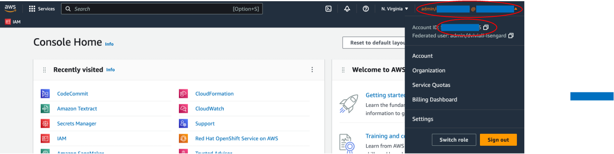
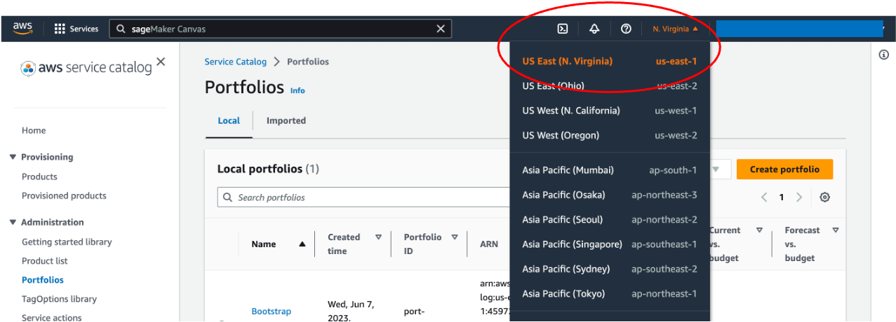
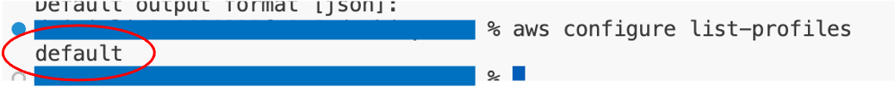
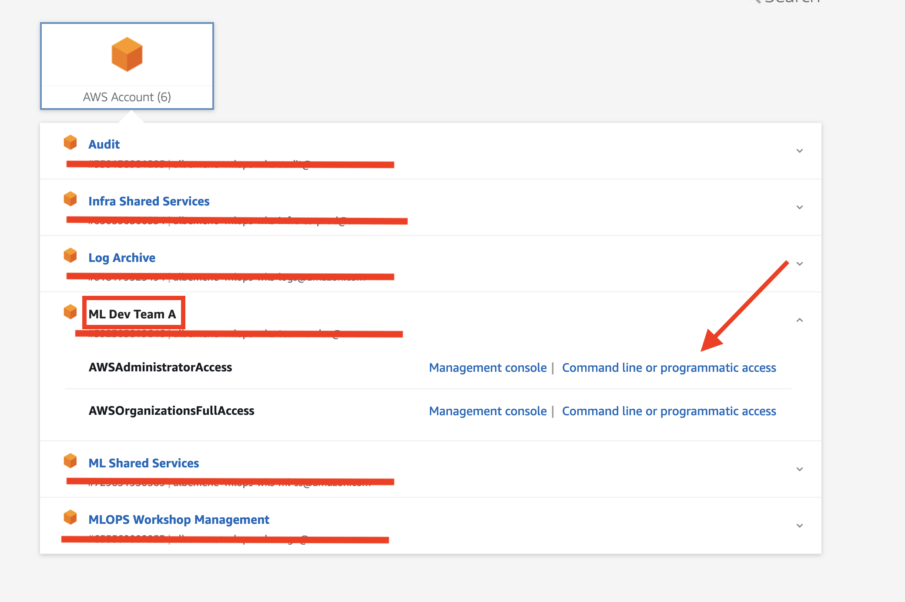
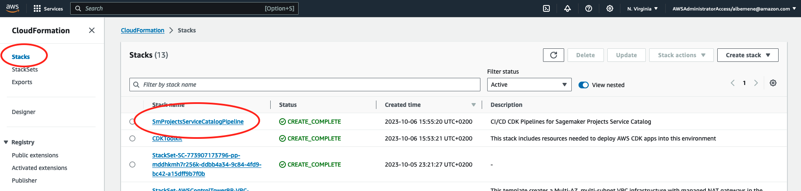
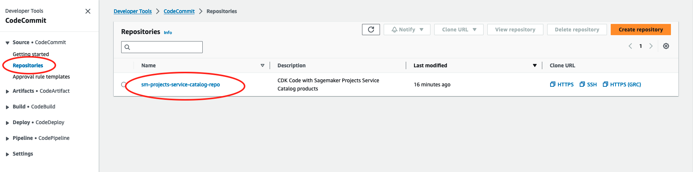
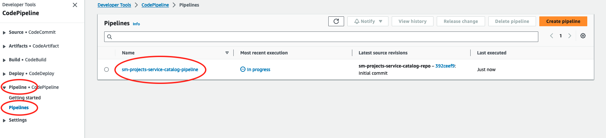
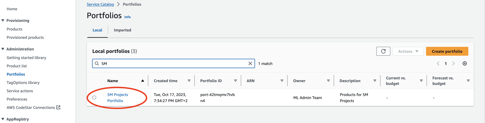

# SageMaker Projects Portfolio Set Up

this portfolio will contain the Sagemaker Projects products to be used by the ML teams to accelerate their ML models development while complying with the organization´s best practices.

## Prerequisites

- We assume a role with required permissions and appropriate access has been set up to access the ML Shared Services Infra account from the AWS CLI. More information on this can be found on [Configure the AWS CLI to use AWS IAM Identity Center](https://docs.aws.amazon.com/cli/latest/userguide/cli-configure-sso.html) and [Use an IAM Role in the AWS CLI](https://docs.aws.amazon.com/cli/latest/userguide/cli-configure-role.html)

## Account access

For cdk deployment you will need the "target account id" and "target region" where you want to deploy the portfolios, we recommend this to be your ML Shared Services Account.

To find the "target account id", click the account information on the top right corner of the console page. The 12-digit number after "Account ID" is the target account id.



On the left side of the account id, click the region name, and copy the region, which should have the format of \<country code\>-\<region\>-\<number\>, such as "us-east-1".



Use the following command to find "target account profile". For example, mine is called "default".

```bash
aws configure list-profiles
```



You can also get temporary programmatic access by going into the Iam Identity Center sign in portal, looking for the account where you need AWS CLI access, click on the *Command line or programmatic access* link and follow the instructions.



For more information, read [AWS CDK: Bootstrapping](https://docs.aws.amazon.com/cdk/v2/guide/bootstrapping.html#bootstrapping-howto).

### Required Packages

The AWS Cloud Development Kit (CDK) is written in python. Below is a list of packages required to deploy the code in this workshop. It is preferred to use a linux OS to be able to run all cli commands and avoid path issues.

- [Node.js](https://nodejs.org/)
- [Python](https://www.python.org/downloads/) or [Miniconda](https://docs.conda.io/en/latest/miniconda.html)
- [AWS CDK v2](https://aws.amazon.com/cdk/)
- [AWS CLI](https://aws.amazon.com/cli/)
- [Docker](https://docs.docker.com/desktop/)

## Set up the Sagemaker Projects portfolio

### Deploy the Pipeline Stack

We will create the AWS CodeCommit repository that will host the CDK code for the Organization SageMaker Projects' templates and the AWS CodePipeline pipeline that will convert this code into Service Catalog products to be shared with Sandbox accounts.

#### Step 1: Bootstrap the Infrastructure of the Shared Services account

In this step, we will bootstrap the infrastructure for the Sagemaker Projects portfolio in the ML Shared Services account.

Clone the code [Git Repository](git@github.com:aws-samples/data-and-ml-governance-workshop.git) to a local directory.

Clone the code [Git Repository](https://github.com/aws-samples/data-and-ml-governance-workshop.git) to a local directory.

```bash
git clone https://github.com/aws-samples/data-and-ml-governance-workshop.git
```

Change directory to ml-platform-shared-services/module-3/sagemaker-projects-portfolio directory.

```bash
cd data-and-ml-governance-workshop/module-3/sagemaker-projects-portfolio
```

Install dependencies in a separate python environment using your favorite python packages manager.

```bash
python3 -m venv env
source env/bin/activate
pip install -r requirements.txt
```

Bootstrap your deployment target account using the following command:

```bash
cdk bootstrap aws://<target account id>/<target region> --profile <target account profile>
```

or if you make sure that you have the right role: `aws sts get-caller-identity` and the right region `aws configure get region` simply run:

```bash
cdk bootstrap
```

#### Step 2: Create the Service Catalog portfolio

Now we are going to set up the required resources in our ML Shared Services Account. For that follow this steps:

Deploy the stack with the CodeCommit repository and the corresponding pipeline.

```bash
cdk deploy --all --require-approval never
```

This may take a few minutes. Once it's finished, you should see the message containing the ARN of the deployed stack.

Let's check the stack deployed.

First, navigate to the [AWS CloudFormation console](https://us-east-1.console.aws.amazon.com/cloudformation/home).



Then click "Stacks" on the CloudFormation page.

You should see a stack named "SmProjectsServiceCatalogPipeline". This is the stack that created resources such as CodeCommit repository, CodePipeline, S3 buckets, and etc.

Let's check out the resources created. Take the CodeCommit repository as an example.

Type "CodeCommit" in the search bar, and then click "CodeCommit" in the dropdown menu.

You can see there's a repository named "sm-projects-service-catalog-repo". If you click the repository name, you will notice the repository is currently empty. Soon we will push code to it.



We recommend to create a separate folder for the different repositories that will be created in the platform. To do that, get out of the cloned repository and create a parallel folder called platform-repositories

```bash
cd ../../.. # (as many .. as directories you have moved in)
mkdir platform-repositories
```

Let´s clone and fill the empty created repository

```bash
cd platform-repositories
git clone codecommit://sm-projects-service-catalog-repo
cd sm-projects-service-catalog-repo
cp -aR ../../ml-platform-shared-services/module-3/sagemaker-projects-portfolio/. .
```

Let's push the code to the CodeCommit Repository to create the Service Catalog portfolio. Run the code below.

```bash
git add .
git commit -m "Initial commit"
git push -u origin main
```

Once it is pushed, let's go back to the CodeCommit repository we created earlier. Now it's no longer empty. Once the code is pushed to the code repository, it triggers the CodePipeline run to build and deploy artifacts to the Service Catalog. Click Pipelines -> Pipeline to check it out. You will see a pipeline named "cdk-service-catalog-pipeline". Click on the pipeline name to check out the steps of it. For more information, read [AWS CodePipeline](https://aws.amazon.com/codepipeline/?nc=sn&loc=1).



It takes about 10 minutes for the pipeline to finish running. Once it's finished, let's check out the Service Catalog Portfolios.

Type "Service Catalog" in the search bar and click on "Service Catalog"

On the Service Catalog page, click "Portfolio" under "Administration". You will see a portfolio named "SM Projects Portfolio".



A product is a set of AWS cloud resources that you want to make available for deployment on AWS. Click on one of the products, and then click on the version name, you can see what's inside the product is mainly a CloudFormation template, which allows you to deploy infrastructure as code. For more information about CloudFormation templates, read
[AWS CloudFormation](https://aws.amazon.com/cloudformation/).

## Next steps

Now that we have set up and configure the ML Shared Services Account and the portfolios lets find out how we can make this products available to all the ML accounts in our next section

## FAQ and Common Errors

## Common Errors

- CDK Version:

> ❌ **Error**:
This CDK CLI is not compatible with the CDK library used by your application. Please upgrade the CLI to the latest version.
(Cloud assembly schema version mismatch: Maximum schema version supported is 34.0.0, but found 35.0.0)

This error happens when the CDK Cli version and the Virtual Environment aws-cdk-lib package version is not the same.

To check both of them run ```cdk --version``` for the CDK Cli and ```pip list``` for the aws-cdk-lib python package.

How to solve?: You can either modify the cdk cli version or the pip version.

- CodeBuild concurrent runs

> ❌ **Error**:

```bash
Error calling startBuild: Cannot have more than 1 builds in queue for the account (Service: AWSCodeBuild; Status Code: 400; Error Code: AccountLimitExceededException; Request ID: xxxxx; Proxy: null)
```

This error happens because the given quota for our CodeBuild Environments is lower than the one required for the concurrent build of the Service Catalog Portfolio Products.

How to solve?: See the following [Article](https://repost.aws/questions/QUkKVl--5kSmCW42h1sZyq1w/codebuild-error-cannot-have-more-than-0-builds-in-queue-for-the-account) and request a quota increase as specified in: [Requesting a quota increase](https://docs.aws.amazon.com/servicequotas/latest/userguide/request-quota-increase.html)


